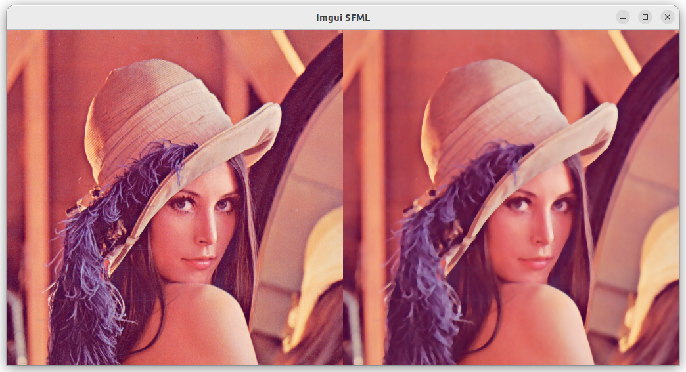

# Hello ImGui with OpenCV

This is a "Hello World" for ImGUI using OpenCV in Ubuntu, with
SFML as back-end.

Steps:
  - Init
  - Load the cv::image (cv::Mat)
  - Add alpha channel
  - Create a sf::image from the cv::image
  - Create a sf::Texture from the image
  - Add the texture to a sf::Sprite
  - Draw the sprite

The input image is loaded with cv::imread, processed in opencv to apply a median
blur, then loaded into sfml to a sprite, and rendered via imgui.

## Output

The expected result is:

